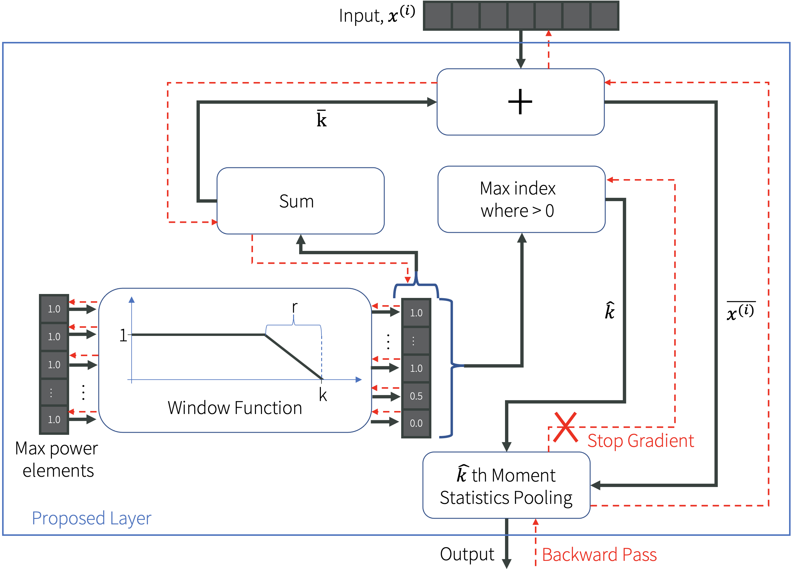

# Learnable Moments Pooling



This is the code for the paper , accepted at ICASSP 2024. This work enables the statistical moment order (e.g., 1=mean, 2=variance, 3=skewness, 4=kurtosis) to be learned from data. This is typically a non-differentiable process. To overcome this limitation, we introduce a continuous relaxation of the moment order. This allows us to learn the moment order from data using gradient descent. We show that this approach outperforms fixed moment order pooling and other learnable moment order pooling methods.

<!-- <!DOCTYPE html> -->
<html>
<body>

<table>
  <tr style="border-bottom: 2pt solid black;">
    <th style="background-color: #f2f2f2;">Type</th>
    <th style="background-color: #f2f2f2;">Statistics</th>
    <th style="background-color: #f2f2f2;">Shared Weights</th>
    <th style="background-color: #f2f2f2;">Test Accuracy (%)</th>
    <th style="background-color: #f2f2f2;">Peak Accuracy (%)</th>
    <th style="background-color: #f2f2f2;"># Params (K)</th>
  </tr>

  <tr>
    <td rowspan="3">Raw</td>
    <td>[μ]</td>
    <td>✔</td>
    <td>62.93</td>
    <td>97.45</td>
    <td>200.72</td>
  </tr>
  <tr>
    <td>[U]</td>
    <td>✔</td>
    <td><strong>63.15</strong></td>
    <td><strong>97.82</strong></td>
    <td>200.721</td>
  </tr>
  <tr>
    <td>[U]</td>
    <td>—</td>
    <td>62.94</td>
    <td>97.65</td>
    <td>200.828</td>
  </tr>

  <tr style="background-color: #f2f2f2;">
    <td rowspan="5">Central</td>
    <td>[μ, σ²]</td>
    <td>✔</td>
    <td>63.54</td>
    <td><strong>98.80</strong></td>
    <td>214.544</td>
  </tr>
  <tr style="background-color: #f2f2f2;">
    <td>[U, Σ]</td>
    <td>✔</td>
    <td>63.67</td>
    <td>98.77</td>
    <td>214.548</td>
  </tr>
  <tr style="background-color: #f2f2f2;">
    <td>[U, Σ]</td>
    <td>—</td>
    <td>63.49</td>
    <td>98.67</td>
    <td>214.762</td>
  </tr>
  <tr style="background-color: #f2f2f2;">
    <td>[U, σ²]</td>
    <td>✔</td>
    <td><strong>63.68</strong></td>
    <td>98.75</td>
    <td>214.545</td>
  </tr>
  <tr style="background-color: #f2f2f2;">
    <td>[U, σ²]</td>
    <td>—</td>
    <td>63.51</td>
    <td>98.62</td>
    <td>214.652</td>
  </tr>

  <tr>
  <td rowspan="6">Std.</td>
  <td>[μ, σ², γ]</td>
  <td>✔</td>
  <td>62.96</td>
  <td><strong>98.84</strong></td>
  <td>228.368</td>
</tr>

<tr>
  <td>[μ, σ², γ, κ]</td>
  <td>✔</td>
  <td>63.30</td>
  <td>98.79</td>
  <td>242.192</td>
</tr>

<tr>
  <td>[U, Σ, Γ]</td>
  <td>✔</td>
  <td><strong>63.35</strong></td>
  <td>98.72</td>
  <td>228.373</td>
</tr>

<tr>
  <td>[U, Σ, Γ]</td>
  <td>—</td>
  <td>62.76</td>
  <td>97.68</td>
  <td>228.694</td>
</tr>

<tr>
  <td>[U, σ², γ, κ]</td>
  <td>✔</td>
  <td>63.00</td>
  <td>98.65</td>
  <td>242.193</td>
</tr>

<tr style="border-bottom: 2pt solid black;">
  <td>[U, σ², γ, κ]</td>
  <td>—</td>
  <td>62.93</td>
  <td>98.60</td>
  <td>242.3</td>
</tr>

</table>
</body>
</html>

\*Note: Capital letters denote learnable moments, while lowercase letters denote fixed moments.

## Table of Contents

- [Learnable Moments Pooling](#learnable-moments-pooling)
  - [Table of Contents](#table-of-contents)
  - [Installation](#installation)
    - [With Git](#with-git)
    - [Manual](#manual)
  - [Run Experiments](#run-experiments)
  - [Citation](#citation)

## Installation

### With Git

To install this code, run the following in your environment:

```bash
pip install git+https://github.com/caharper/learnable_moments_pooling
```

### Manual

To install this code manually, clone this repo and run the following in your environment:

```bash
git clone https://github.com/caharper/learnable_moments_pooling
cd learnable_moments_pooling
python setup.py install
```

## Run Experiments

We provide our experimental configuration for the RadioML 2018.01A dataset ([download here](https://www.deepsig.ai/datasets/)) under the [./experiments](./experiments/modulation/) directory. To process the data into TFRecord format for optimal performance, we make use of the [smart-tfrecord-writer](https://github.com/caharper/smart-tfrecord-writer/tree/main) package. To convert the dataset into this format, follow the guide [here](https://github.com/caharper/smart-tfrecord-writer/blob/main/examples/radioml/README.md).

Once the dataset is configured, we make use of the [`bocas`](https://github.com/LukeWood/bocas) package to run our experiments. To run the experiments, run the following in your environment:

```bash
cd experiments/modulation
python -m bocas.launch run.py --task run.py --config configs/sweep-learned.py
```

Make sure to pass the appropriate configuration file. Our configurations can be found under the [`./experiments/modulation/configs/`](./experiments/modulation/configs/) directory.

## Citation

If you find this code useful, please cite our paper:

```bibtex
@inproceedings{harper2024icassp,
  title={Learnable Statistical Moments Pooling for Automatic Modulation Classification},
  author={Harper, Clayton and Thornton, Mitchell A and Larson, Eric C},
  booktitle={ICASSP 2024-2024 IEEE International Conference on Acoustics, Speech and Signal Processing (ICASSP)},
  year={2024},
  organization={IEEE}
}
```
