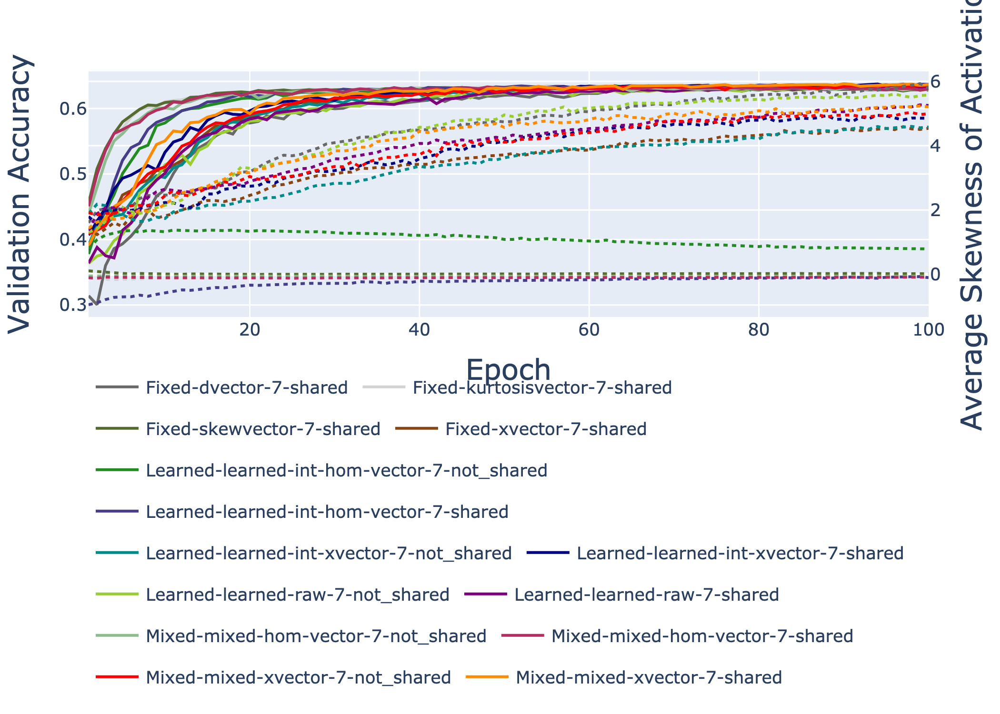

# Result Visualizations

## Validation Accuracy Over Epochs

## Average Mean of Activations and Validation Accuracy Over Epochs

## Average Variance of Activations and Validation Accuracy Over Epochs

## Average Skewness of Activations and Validation Accuracy Over Epochs

## Average Kurtosis of Activations and Validation Accuracy Over Epochs

